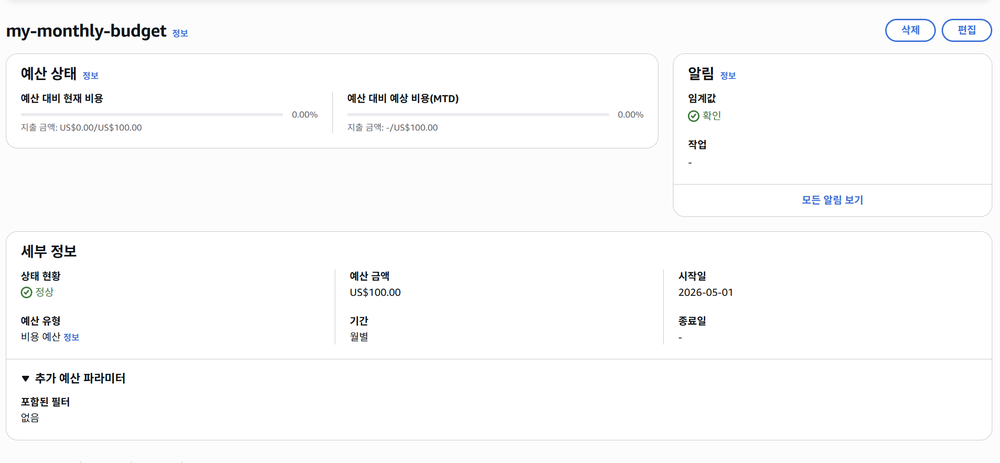
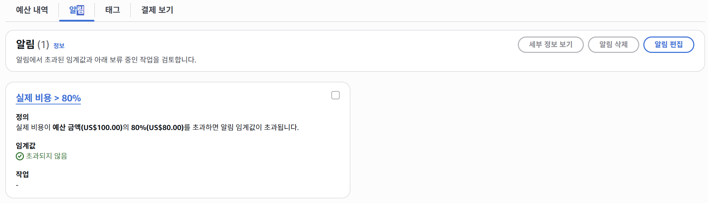
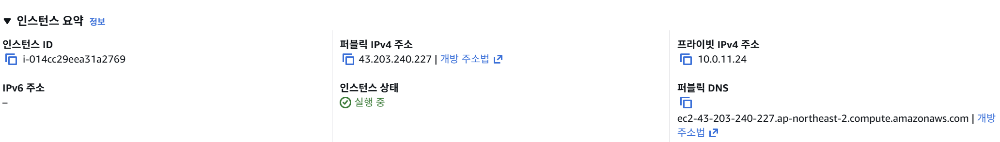
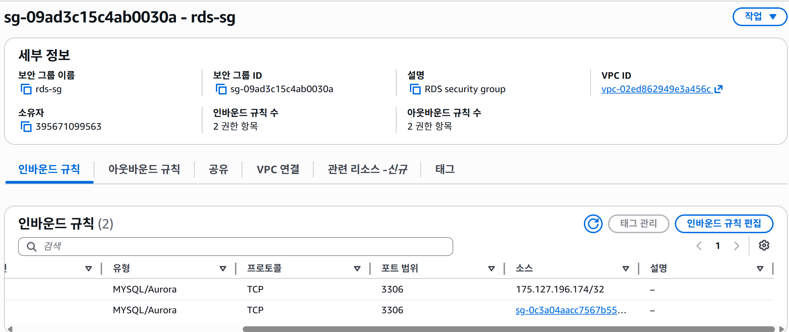
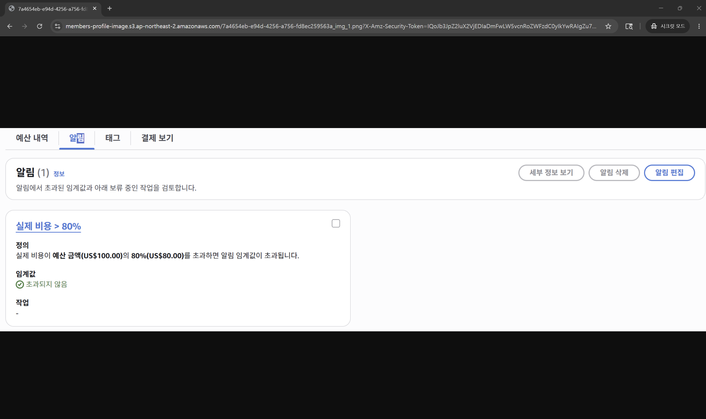

# LEVEL 0 - 요금 폭탄 방지 AWS Budget 설정

## 개요
클라우드 실습 중 요금 폭탄 방지를 위해 AWS Budgets 월 예산 알림을 설정합니다.

## 설정 내용
- 월 예산: $100
- 알림 조건: 예산의 80% 도달 시 이메일 알림

## 설정 화면

# LEVEL 1 - 네트워크 구축 및 핵심 기능 배포
- 퍼블릭 IP: `43.203.240.227`
- Actuator Health Check: http://43.203.240.227:8080/actuator/health

## 퍼블릭 IP

# LEVEL 2 - DB 분리 및 보안 연결

## Actuator Info 엔드포인트
http://43.203.240.227:8080/actuator/info

## RDS 보안 그룹 설정

# LEVEL 3 - 프로필 사진 기능 추가와 권한 관리

## S3 버킷 설정
- 버킷 이름: `members-profile-image`
- 퍼블릭 액세스 차단: 활성화
- IAM Role을 통한 EC2 접근 권한 설정

## API
- `POST /api/members/{id}/profile-image` - 프로필 이미지 업로드
- `GET /api/members/{id}/profile-image` - Presigned URL 반환 (유효기간 7일)

## Presigned URL 접근 성공 스크린샷

